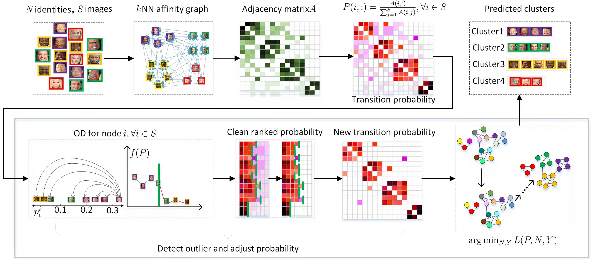

# Adapt-InfoMap
Here we present the source codes for Adapt-InfoMap. Adapt-InfoMap is an effective unsupervised method on large-scale dataset for face clustering. 



## Requirements 
 - python=3.7
 - infomap=1.9.0
 - faiss


## Datasets 
```
cd Adapt-InfoMap
```

Create a new folder for data:

```
mkdir data
```
To test our code with the refined MS1M dataset, please follow the link https://github.com/yl-1993/learn-to-cluster to download the dataset and put it in the directory ```/data``` as follow:

```
|——data
   |——MS1M
       |——features
          |——part0_train.bin
          |——part1_test.bin
          |——...
          |——part9_test.bin
       |——labels
          |——part0_train.meta
          |——part1_test.meta
          |——...
          |——part9_test.meta
```

## Configs
To set the configurations, modify the parameters in ```./configs/config.py```.

## Run 
```
cd Adapt-InfoMap
python main.py
```

## Evaluation 
```
cd Adapt-InfoMap
python main_eval.py
```

## Pre-trained Face model
To reproduce our experiments for CASIA and VGGFace2, please use the pre-trained ArcFace model in https://github.com/deepinsight/insightface/tree/master/model_zoo to extract features.
